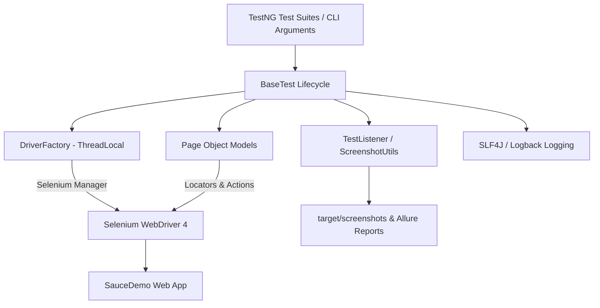

# Ecommerce UI Automation Framework

## 1. Project Overview
This repository contains a production-quality, portfolio-level **Java Selenium UI Automation Framework** designed for automated functional, regression, data-driven, and end-to-end (E2E) testing of an e-commerce web application. Built using modern Java 21 features, TestNG, and the Page Object Model (POM) design pattern, this framework demonstrates industry-standard practices in test design, thread-safe driver management, monetary precision assertions, explicit wait synchronization, and CI/CD integration.

---

## 2. Application Under Test
* **Name:** SauceDemo (Swag Labs)
* **URL:** [https://www.saucedemo.com/](https://www.saucedemo.com/)
* **Description:** A standard web application used for demonstrating e-commerce workflows, including user authentication, product catalog browsing, sorting, shopping cart management, customer information submission, order overview mathematical calculations, and checkout completion.

---

## 3. Technology Stack
* **Programming Language:** Java 21 (JDK 21)
* **Core Automation Engine:** Selenium WebDriver 4.29.0
* **Driver Management:** Native Selenium 4 Selenium Manager (Zero `WebDriverManager` external dependencies)
* **Test Runner & Framework:** TestNG 7.11.0
* **Build Tool:** Apache Maven 3.9+
* **Design Pattern:** Page Object Model (POM) + ThreadLocal Driver Factory
* **Data-Driven Testing:** TestNG `@DataProvider` with OpenCSV 5.10
* **Reporting Engine:** Allure TestNG 2.29.0
* **Logging Framework:** SLF4J 2.0.16 + Logback Classic 1.5.16
* **CI/CD Integration:** GitHub Actions (`.github/workflows/automation.yml`)
* **Version Control:** Git & GitHub

---

## 4. Framework Features
* **Page Object Model (POM):** Complete separation of element locators and page interaction logic from test assertions.
* **Thread-Safe Driver Factory:** Uses `ThreadLocal<WebDriver>` to support isolated browser instances per test thread.
* **Cross-Browser & Execution Modes:** Supports local execution across Chrome, Firefox, and Edge in both headed and headless modes via runtime properties (`-Dbrowser`, `-Dheadless`).
* **Optional Remote Grid Support:** Built-in capability to target RemoteWebDriver endpoints (e.g. `-Dgrid.enabled=true -Dgrid.url=http://localhost:4444/`).
* **Configuration Management:** Centralized property loading via `ConfigReader.java` with CLI property override priority (`-Dkey=value`).
* **Explicit Wait Synchronization:** Standardized on `WebDriverWait` and `ExpectedConditions` in `WaitUtils.java` (Zero `Thread.sleep` or implicit wait conflicts).
* **Monetary Precision Assertions:** Enforces `java.math.BigDecimal` for all price, subtotal, tax, and total assertions to prevent floating-point rounding errors.
* **Data-Driven Capabilities:** Externalized negative test datasets in `src/test/resources/testdata/login-data.csv` parsed via OpenCSV.
* **Failure Artifact Capture:** Automatic failure screenshot generation in `target/screenshots/` and embedded byte attachments in Allure reports.
* **Structured SLF4J Logging:** Console and file logging for test lifecycle events, browser setup, teardown, and errors without logging plain-text secrets.
* **Test Categorization Groups:** Organized into `smoke`, `regression`, and `e2e` execution groups.
* **Automated CI Pipeline:** GitHub Actions workflow triggering on `push`, `pull_request`, and `workflow_dispatch`.

---

## 5. Framework Architecture



---

## 6. Folder Structure

```
Ecommerce-UI-Automation-Framework/
│
├── pom.xml                               # Maven build file with Java 21, Selenium, TestNG & Allure dependencies
├── testng.xml                            # TestNG suite runner with parallel settings & listeners
├── README.md                             # Framework documentation
├── .gitignore                            # Git exclusion rules
│
├── .github/
│   └── workflows/
│       └── automation.yml                # GitHub Actions CI workflow pipeline
│
├── src/main/java/com/qa/
│   ├── base/
│   │   └── DriverFactory.java            # ThreadLocal WebDriver manager supporting Local & Grid execution
│   │
│   ├── pages/
│   │   ├── LoginPage.java                # Login page locators & actions
│   │   ├── InventoryPage.java            # Product catalog page object
      ├── ProductDetailsPage.java       # Product details page object
│   │   ├── CartPage.java                 # Cart page object
│   │   ├── CheckoutInformationPage.java  # Customer details page object
│   │   ├── CheckoutOverviewPage.java     # Checkout overview & BigDecimal monetary parsing
│   │   └── CheckoutCompletePage.java     # Order completion confirmation page object
│   │
│   └── utils/
│       ├── ConfigReader.java             # System property & config loader
│       ├── WaitUtils.java                # Explicit wait utilities
│       ├── ScreenshotUtils.java          # Local PNG screenshot & Allure attachment generator
│       └── TestDataUtils.java            # CSV dataset parser via OpenCSV
│
├── src/test/java/com/qa/
│   ├── base/
│   │   └── BaseTest.java                 # Base test class (@BeforeMethod, @AfterMethod tearDown)
│   │
│   ├── tests/
│   │   ├── LoginTest.java                # Login module test scenarios (TC_LOGIN_001 - 010)
│   │   ├── InventoryTest.java            # Inventory catalog & sorting tests (TC_INV_001 - 011)
│   │   ├── ProductDetailsTest.java       # Product details navigation tests (TC_PD_001 - 002)
│   │   ├── CartTest.java                 # Shopping cart tests (TC_CART_001 - 011)
│   │   ├── CheckoutTest.java             # Checkout information & total validation tests (TC_CHECKOUT_001 - 014)
│   │   └── EndToEndTest.java             # 25-step complete purchasing journey (TC_E2E_001)
│   │
│   ├── listeners/
│   │   ├── TestListener.java             # TestNG lifecycle & failure artifact listener
│   │   ├── RetryAnalyzer.java            # Controlled retry analyzer for transient failures
│   │   └── AnnotationTransformer.java    # Dynamic listener transformer for TestNG annotations
│   │
│   └── dataproviders/
│       └── LoginDataProvider.java        # DataProvider supplying CSV login data
│
├── src/test/resources/
│   ├── config.properties                 # Default framework property configurations
│   ├── logback.xml                       # Logback logger layout configuration
│   ├── allure.properties                 # Allure result directory configuration
│   └── testdata/
│       └── login-data.csv                # Data-driven CSV dataset for negative login testing
│
└── docs/
    ├── TestPlan.md                       # QA Master Test Plan
    ├── TestScenarios.md                  # Test scenario coverage matrix
    ├── TestCases.csv                     # Test case repository with execution statuses
    ├── BugReports.md                     # Failure classification log & sample defect report
    ├── RequirementsTraceabilityMatrix.csv# Requirements traceability matrix
    ├── TestExecutionSummary.md           # Execution results summary report
    └── InterviewGuide.md                 # Architecture Q&A for technical interviews
```

---

## 7. Automated Modules
1. **Authentication / Login (`LoginTest.java`):** Valid credentials, invalid username, invalid password, empty username, empty password, locked-out user, password masking, logout, CSV data-driven scenarios, and protected page access redirection.
2. **Product Inventory Catalog (`InventoryTest.java`):** Listing container validation, product titles, BigDecimal prices, image rendering, A-Z/Z-A name sorting via Java Collections, Low-High/High-Low price sorting.
3. **Product Details (`ProductDetailsTest.java`):** Navigation from catalog to individual item view, title/description/price verification, and back navigation.
4. **Shopping Cart (`CartTest.java`):** Single item addition, multiple item addition, dynamic badge state counter (0 -> 1 -> 2 -> 1 -> 0), product title/price validation in cart, removal from inventory page, removal from cart page, cart evacuation, and state persistence across page navigation.
5. **Checkout Flow (`CheckoutTest.java`):** Information submission (first name, last name, zip), missing field validations, payment summary (`SauceCard`), shipping summary (`Free Pony Express`), BigDecimal subtotal calculation, tax validation, mathematical validation (`Total = Subtotal + Tax`), cancel flow, finish checkout, and order completion headers.
6. **End-to-End Journey (`EndToEndTest.java`):** Realistic 25-step customer purchasing flow from initial login to order confirmation, back to inventory, and final session logout.

---

## 8. Test Coverage
* **Total Automated Tests Implemented:** **52 Test Cases** (53 total executions including CSV DataProvider iterations).
* **Test Classes:** 6 (`LoginTest`, `InventoryTest`, `ProductDetailsTest`, `CartTest`, `CheckoutTest`, `EndToEndTest`).
* **Pass Rate:** **100%** (52/52 PASSED on standard user execution).

---

## 9. Prerequisites
* **Java Development Kit:** JDK 21 installed and configured in system `PATH` (`JAVA_HOME`).
* **Build Tool:** Apache Maven 3.9+ installed and configured in system `PATH`.
* **Version Control:** Git.
* **Browser:** Google Chrome installed locally.

---

## 10. Installation
```bash
# 1. Clone the repository
git clone https://github.com/your-username/Ecommerce-UI-Automation-Framework.git

# 2. Navigate into the project directory
cd Ecommerce-UI-Automation-Framework

# 3. Verify environment and compile test classes
mvn clean test-compile
```

---

## 11. Execution Commands

### Full Suite Execution (Default Headless Chrome)
```bash
mvn clean test -Dheadless=true
```

### Execution by Test Groups
```bash
# Run Smoke Test Suite (10 tests)
mvn test -Dgroups=smoke -Dheadless=true

# Run Full Regression Test Suite (51 tests)
mvn test -Dgroups=regression -Dheadless=true

# Run End-to-End Customer Journey (1 test / 25 steps)
mvn test -Dgroups=e2e -Dheadless=true
```

### Cross-Browser Execution Options
```bash
# Google Chrome (Headed)
mvn test -Dbrowser=chrome -Dheadless=false

# Google Chrome (Headless)
mvn test -Dbrowser=chrome -Dheadless=true

# Mozilla Firefox (Headless - Requires local Firefox installation)
mvn test -Dbrowser=firefox -Dheadless=true

# Microsoft Edge (Headless - Requires local Edge installation)
mvn test -Dbrowser=edge -Dheadless=true
```

### Optional Remote Selenium Grid Execution
```bash
mvn test -Dgrid.enabled=true -Dgrid.url=http://localhost:4444/ -Dbrowser=chrome -Dheadless=true
```

---

## 12. Test Data Management
* **Inline DataProviders:** Used for quick parameterization within test classes.
* **External CSV Datasets:** Negative login test scenarios are externalized in `src/test/resources/testdata/login-data.csv`.
* **CSV Parsing Utility:** `TestDataUtils.java` utilizes OpenCSV to parse CSV rows into `Object[][]` arrays for TestNG DataProviders. Double quotes enclose strings containing commas to prevent column shifting.

---

## 13. Reports & Artifacts
* **TestNG / Surefire Reports:** Standard XML and HTML summary reports are generated at `target/surefire-reports/index.html`.
* **Allure Reports:** Raw Allure JSON result files are output to `target/allure-results/`.
  To view the interactive Allure report in browser:
  ```bash
  allure serve target/allure-results
  ```
  Alternatively, generate standalone HTML files:
  ```bash
  mvn allure:report
  ```
* **Failure Screenshots:** Generated locally on test failure at `target/screenshots/` with timestamped and sanitized filenames.

---

## 14. CI/CD Integration
The project includes a GitHub Actions continuous integration workflow defined in `.github/workflows/automation.yml`.
* **Triggers:** Pushes to `main`, Pull Requests targeting `main`, and manual execution via `workflow_dispatch`.
* **Pipeline Environment:** Runs on `ubuntu-latest` with JDK 21 and Maven caching.
* **Execution:** Executes `mvn clean test -Dheadless=true`.
* **Artifact Archiving:** Uploads `surefire-reports`, `allure-results`, and `failure-screenshots` (on failure) as downloadable pipeline artifacts.

---

## 15. Cross-Browser Status & Verification
* **Google Chrome:** Fully verified and operational (**100% pass rate**).
* **Mozilla Firefox:** Configured in `DriverFactory` via `FirefoxOptions`. (Not executed locally due to missing Firefox binary on execution environment).
* **Microsoft Edge:** Configured in `DriverFactory` via `EdgeOptions`. (Not executed locally due to remote driver endpoint version mismatch on host environment).

---

## 16. Manual Testing & Quality Documentation
Located in the `docs/` directory:
* [`TestPlan.md`](file:///c:/Users/princ/OneDrive/Desktop/QA_UI/docs/TestPlan.md): Comprehensive master test plan covering scope, strategy, environments, and risks.
* [`TestScenarios.md`](file:///c:/Users/princ/OneDrive/Desktop/QA_UI/docs/TestScenarios.md): High-level feature scenarios covering authentication, catalog, cart, and checkout.
* [`TestCases.csv`](file:///c:/Users/princ/OneDrive/Desktop/QA_UI/docs/TestCases.csv): Formal test case repository with steps, preconditions, expected results, and statuses.
* [`BugReports.md`](file:///c:/Users/princ/OneDrive/Desktop/QA_UI/docs/BugReports.md): Failure classification log, confirmed defects statement, and sample bug report format.
* [`RequirementsTraceabilityMatrix.csv`](file:///c:/Users/princ/OneDrive/Desktop/QA_UI/docs/RequirementsTraceabilityMatrix.csv): Requirements-to-test traceability matrix.
* [`TestExecutionSummary.md`](file:///c:/Users/princ/OneDrive/Desktop/QA_UI/docs/TestExecutionSummary.md): Detailed metrics and pass rate breakdown.

---

## 17. Actual Execution Results

```
[INFO] Running TestSuite
[INFO] Tests run: 52, Failures: 0, Errors: 0, Skipped: 0, Time elapsed: 134.7 s -- in TestSuite
[INFO] ------------------------------------------------------------------------
[INFO] BUILD SUCCESS
[INFO] ------------------------------------------------------------------------
```

---

## 18. Known Limitations
1. **Third-Party Application Scope:** SauceDemo is a static demo application; backend database operations, email receipts, and real payment gateway processing are not supported by the AUT.
2. **Environment Baseline:** Full suite verification was executed on Windows 11 with Chrome 154 in headless mode. Other browser binaries (Firefox) were not available on the execution host.

---

## 19. Future Improvements
* Set up a Dockerized Selenium Grid cluster (`docker-compose`) for multi-browser parallel container execution.
* Integrate cloud grid providers (BrowserStack / Sauce Labs) for mobile web responsive testing.
* Expand CSV test datasets for checkout customer information negative validation scenarios.

---

## 20. Learning Outcomes
Through building this automation framework, key QA engineering competencies were demonstrated:
* Designing robust Page Object Model (POM) structures that decouple test logic from locators.
* Managing thread-safe browser sessions using Java `ThreadLocal` and Selenium Manager.
* Implementing explicit wait synchronization strategies to handle dynamic React DOM re-renders.
* Applying monetary precision validation using `java.math.BigDecimal` for financial calculations.
* Externalizing test data using TestNG DataProviders and CSV file readers.
* Setting up automated CI pipelines with GitHub Actions, Allure reporting, and failure screenshot capturing.
