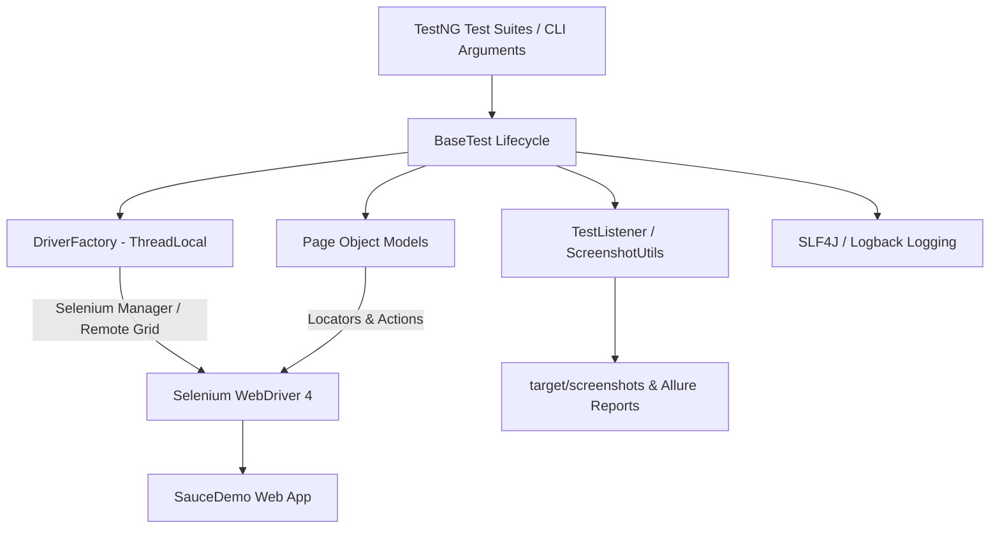

# ⚡ Ecommerce UI Automation Framework (SauceDemo)

<p align="center">
  <b>Enterprise-Grade SDET Automation Framework for <a href="https://www.saucedemo.com/">SauceDemo (Swag Labs)</a></b><br>
  Built with <b>Java 21</b>, <b>Selenium WebDriver 4.29.0</b>, <b>TestNG 7.11.0</b>, <b>Selenium Manager</b>, <b>Allure Reports 2.29.0</b>, <b>OpenCSV</b>, and <b>GitHub Actions CI/CD</b>.
</p>

<p align="center">
  
  
  
  
  
  
  
</p>

---

## 📑 Table of Contents

- [🔍 Overview](#-overview)
- [🏛 Key Architectural Highlights & Interview Defensibility](#-key-architectural-highlights--interview-defensibility)
- [🎨 Design Patterns Implemented](#-design-patterns-implemented)
- [📐 Framework Architecture](#-framework-architecture)
- [📂 Repository Structure](#-repository-structure)
- [🧪 Test Coverage Matrix (All 52 Automated Tests)](#-test-coverage-matrix-all-52-automated-tests)
- [💻 Prerequisites](#-prerequisites)
- [🚀 Local Setup & Execution](#-local-setup--execution)
- [📤 Step-by-Step: How to Push to GitHub](#-step-by-step-how-to-push-to-github)
- [📊 Allure Reporting & Failure Screenshots](#-allure-reporting--failure-screenshots)
- [⚙️ CI/CD Integration](#️-cicd-integration)
- [📄 QA Portfolio Documentation](#-qa-portfolio-documentation)
- [👤 Author & Acknowledgments](#-author--acknowledgments)

---

## 🔍 Overview

This repository contains a production-ready, enterprise-grade test automation framework engineered as a showcase portfolio project for **SDET / QA Automation Engineer** roles. It automates comprehensive user journeys across [SauceDemo (Swag Labs)](https://www.saucedemo.com/), covering user authentication, product catalog browsing, dynamic sorting, shopping cart operations, customer checkout information submission, price calculation assertions, order completion, and full end-to-end purchasing scenarios.

The framework strictly adheres to **industry best practices**: zero flaky explicit sleeps (`Thread.sleep`), thread-safe browser management using `ThreadLocal<WebDriver>`, fluent Page Object Model (POM) encapsulation, monetary precision assertions using `java.math.BigDecimal`, automated failure screenshot attachments, structured SLF4J/Logback logging, and automated CI/CD execution via GitHub Actions.

---

## 🏛 Key Architectural Highlights & Interview Defensibility

When discussing this framework in technical interviews, highlight these core engineering decisions:

### 1. 🛡 Thread-Safe Parallel Execution via `ThreadLocal<WebDriver>`
- **The Challenge:** Parallel test execution with TestNG can lead to thread-safety issues when multiple threads attempt to mutate shared `WebDriver` state.
- **The Solution:** `DriverFactory.java` isolates driver instances using Java's `ThreadLocal<WebDriver>`. Each executing test thread accesses its own isolated browser context, allowing parallel method execution (`thread-count="2"`) without flaky driver conflicts.

### 2. ⏱ Strict Zero `Thread.sleep` Guarantee
- Pure explicit synchronization using `WebDriverWait` and `ExpectedConditions` encapsulated in `WaitUtils.java`.
- Dynamic element locators switch to non-blocking `driver.findElements()` for zero-element empty states to prevent unnecessary 5-second timeouts.

### 3. 💰 Monetary Precision Assertions using `BigDecimal`
- **The Challenge:** Standard `double` or `float` arithmetic in Java causes floating-point rounding errors (e.g., `29.99 + 9.99 = 39.979999999999997`), causing flaky assertion failures in e-commerce financial totals.
- **The Solution:** `CheckoutOverviewPage.java` extracts subtotal, tax, and item prices as `java.math.BigDecimal`, performing exact monetary calculations (`Subtotal + Tax = Total`) with `setScale(2, RoundingMode.HALF_UP)`.

### 4. 📁 Runtime Directory Resilience & Allure Integration
- `ScreenshotUtils.java` automatically creates missing output directories (`target/screenshots/`) before capturing full viewport screenshots upon any test failure.
- Screenshots are saved with timestamped, sanitized filenames and automatically attached to Allure HTML reports via `@Attachment` byte streaming.

### 5. 🔄 Data-Driven Testing via OpenCSV
- Negative authentication test cases are externalized in `src/test/resources/testdata/login-data.csv`.
- `TestDataUtils.java` parses external CSV files using OpenCSV into `Object[][]` arrays for TestNG `@DataProvider` injection.

---

## 🎨 Design Patterns Implemented

| Design Pattern | Implementation Class | Purpose |
|---|---|---|
| **Page Object Model (POM)** | `com.qa.pages.*` (7 Page Classes) | Decouples page locators and interaction logic from test assertions. |
| **Factory Pattern** | `com.qa.base.DriverFactory` | Centralizes creation and configuration of browser instances (Chrome, Firefox, Edge, Headless, Remote Grid). |
| **Observer Pattern** | `com.qa.listeners.TestListener` | Listens to TestNG lifecycle events (`onTestStart`, `onTestFailure`, `onTestSuccess`) to log execution status and attach screenshots. |
| **ThreadLocal Storage** | `DriverFactory.driverThreadLocal` | Isolates `WebDriver` instances per executing thread for parallel safety. |
| **Data-Driven Pattern** | `com.qa.dataproviders.LoginDataProvider` | Injects external CSV test parameters into parameterized TestNG test methods. |
| **Retry Pattern** | `com.qa.listeners.RetryAnalyzer` | Intercepts transient infrastructure exceptions and retries them (max 1 retry), strictly excluding functional `AssertionError` failures. |

---

## 📐 Framework Architecture



---

## 📂 Repository Structure

```
Ecommerce-UI-Automation-Framework/
├── .github/
│   └── workflows/
│       └── automation.yml                # GitHub Actions CI/CD (Tests + Artifacts)
├── docs/
│   ├── TestPlan.md                       # Master QA Test Plan
│   ├── TestScenarios.md                  # Test Scenario Coverage Matrix
│   ├── TestCases.csv                     # Test Case Repository
│   ├── BugReports.md                     # Defect Log & Sample Bug Report
│   ├── RequirementsTraceabilityMatrix.csv# RTM
│   ├── TestExecutionSummary.md           # Metrics & Results Breakdown
│   └── InterviewGuide.md                 # Technical Interview Architecture Q&A
├── reports/
│   └── .gitkeep                          # Git directory persistence
├── screenshots/
│   └── .gitkeep                          # Git directory persistence
├── src/
│   ├── main/
│   │   └── java/
│   │       └── com/qa/
│   │           ├── base/
│   │           │   └── DriverFactory.java # ThreadLocal WebDriver Manager (Local & Remote Grid)
│   │           ├── pages/
│   │           │   ├── LoginPage.java
│   │           │   ├── InventoryPage.java
│   │           │   ├── ProductDetailsPage.java
│   │           │   ├── CartPage.java
│   │           │   ├── CheckoutInformationPage.java
│   │           │   ├── CheckoutOverviewPage.java
│   │           │   └── CheckoutCompletePage.java
│   │           └── utils/
│   │               ├── ConfigReader.java  # Property reader with CLI override
│   │               ├── WaitUtils.java     # Explicit wait wrappers (zero Thread.sleep)
│   │               ├── ScreenshotUtils.java# Failure screenshot generator & Allure attacher
│   │               └── TestDataUtils.java # OpenCSV data parser
│   └── test/
│       ├── java/
│       │   └── com/qa/
│       │       ├── base/
│       │       │   └── BaseTest.java      # Test setup & teardown lifecycle
│       │       ├── dataproviders/
│       │       │   └── LoginDataProvider.java # CSV test data provider
│       │       ├── listeners/
│       │       │   ├── TestListener.java  # TestNG listener for Allure & logging
│       │       │   ├── RetryAnalyzer.java # Controlled retry strategy
│       │       │   └── AnnotationTransformer.java # Dynamic retry annotation injector
│       │       └── tests/
│       │           ├── LoginTest.java     # TC_LOGIN_001 - 010 (14 tests)
│       │           ├── InventoryTest.java # TC_INV_001 - 011 (11 tests)
│       │           ├── ProductDetailsTest.java # TC_PD_001 - 002 (2 tests)
│       │           ├── CartTest.java      # TC_CART_001 - 011 (11 tests)
│       │           ├── CheckoutTest.java  # TC_CHECKOUT_001 - 014 (14 tests)
│       │           └── EndToEndTest.java  # TC_E2E_001 (1 test / 25 steps)
│       └── resources/
│           ├── config.properties          # Default execution parameters
│           ├── logback.xml                # Logback logger layout configuration
│           ├── allure.properties          # Allure result directory configuration
│           └── testdata/
│               └── login-data.csv         # Negative authentication CSV dataset
├── .gitignore                             # Git exclusion rules
├── pom.xml                                # Maven dependencies & compiler plugin
├── README.md                              # Framework documentation
└── testng.xml                             # TestNG suite runner & parallel execution config
```

---

## 🧪 Test Coverage Matrix (All 52 Automated Tests)

| Test Class | Group | Test Count | Key Verification Targets |
|---|---|---|---|
| `LoginTest` | `smoke`, `regression` | **14** | Valid login, locked-out user validation, invalid credentials, empty fields, password masking, logout flow, CSV data-driven scenarios, and session security redirects. |
| `InventoryTest` | `smoke`, `regression` | **11** | Catalog item rendering, title/description/price checks, image link integrity, A-Z and Z-A name sorting, Low-to-High and High-to-Low price sorting. |
| `ProductDetailsTest` | `regression` | **2** | Deep-link item details navigation, title/description/price checks on product detail view, and return navigation. |
| `CartTest` | `smoke`, `regression` | **11** | Single and multi-item additions, dynamic badge counter updates (`0 -> 1 -> 2 -> 1 -> 0`), price checks, removal from inventory page, removal from cart page, cart evacuation, state persistence. |
| `CheckoutTest` | `smoke`, `regression` | **14** | Information form submission, missing field validations (First Name, Last Name, Zip), payment/shipping method summary verification, `BigDecimal` item total, tax calculation, total formula (`Total = Subtotal + Tax`), cancel flow, finish checkout. |
| `EndToEndTest` | `e2e`, `smoke`, `regression` | **1** | Full 25-step customer purchasing flow from initial authentication, catalog browsing, cart verification, checkout info, price calculation assertion, order confirmation, and session logout. |

---

## 💻 Prerequisites

- **Java Development Kit (JDK)**: Version 21 or higher ([Eclipse Temurin JDK 21 Recommended](https://adoptium.net/))
- **Apache Maven**: Version 3.9+ (configured in system `PATH`)
- **Web Browser**: Google Chrome (installed locally; browser drivers managed automatically by Selenium Manager)
- **Git**: Installed for version control

Verify environment versions:
```powershell
java -version
mvn -version
git --version
```

---

## 🚀 Local Setup & Execution

### 1. Clone Repository & Compile
```bash
git clone https://github.com/princepadaliya31/Ecommerce-UI-Automation-Framework.git
cd Ecommerce-UI-Automation-Framework
mvn clean test-compile
```

### 2. Full Suite Execution (Default Headless Chrome)
```bash
mvn clean test -Dheadless=true
```

### 3. Execution by TestNG Groups
```bash
# Run Smoke Test Suite
mvn test -Dgroups=smoke -Dheadless=true

# Run Full Regression Test Suite
mvn test -Dgroups=regression -Dheadless=true

# Run End-to-End Customer Journey
mvn test -Dgroups=e2e -Dheadless=true
```

### 4. Cross-Browser Options
```bash
# Google Chrome (Headed Mode)
mvn test -Dbrowser=chrome -Dheadless=false

# Google Chrome (Headless Mode)
mvn test -Dbrowser=chrome -Dheadless=true

# Mozilla Firefox (Requires local Firefox installation)
mvn test -Dbrowser=firefox -Dheadless=true

# Microsoft Edge (Requires local Edge installation)
mvn test -Dbrowser=edge -Dheadless=true
```

### 5. Remote Selenium Grid Options
```bash
mvn test -Dgrid.enabled=true -Dgrid.url=http://localhost:4444/ -Dbrowser=chrome -Dheadless=true
```

---

## 📤 Step-by-Step: How to Push to GitHub

If modifying or updating your project code locally, execute the following commands to keep GitHub updated:

```bash
# 1. Check current repository status
git status

# 2. Stage all modified/new files
git add .

# 3. Create a conventional commit
git commit -m "feat: enhance framework documentation and test execution parameters"

# 4. Push changes to GitHub main branch
git push origin main
```

---

## 📊 Allure Reporting & Failure Screenshots

- **Surefire Reports:** Standard XML/HTML summaries generated at `target/surefire-reports/index.html`.
- **Allure Raw Results:** Generated at `target/allure-results/`.
- **Failure Screenshots:** Automatically generated on failure at `target/screenshots/`.

### Viewing Allure Reports
To launch the interactive Allure server in your browser:
```bash
allure serve target/allure-results
```

Alternatively, generate static HTML report files:
```bash
mvn allure:report
```

Allure report features include:
- **Overview Dashboard:** Execution duration, pass/fail ratios, environment attributes.
- **Detailed Suite Breakdown:** Method steps, parameters, severity levels.
- **Failure Attachments:** Viewport screenshots embedded directly inside failed test nodes.

---

## ⚙️ CI/CD Integration

This project includes a continuous integration workflow defined in `.github/workflows/automation.yml`.

- **Triggers:** Pushes to `main`, Pull Requests targeting `main`, and manual execution via `workflow_dispatch`.
- **Environment:** Runs on `ubuntu-latest` using Java 21 with Maven caching.
- **Commands:** Executes `mvn clean test -Dheadless=true`.
- **Artifact Archiving:** Uploads `surefire-reports`, `allure-results`, and `failure-screenshots` on workflow completion.

---

## 📄 QA Portfolio Documentation

Located in the [`docs/`](file:///c:/Users/princ/OneDrive/Desktop/QA_UI/docs/) folder:

| Document | Purpose |
|---|---|
| [`TestPlan.md`](file:///c:/Users/princ/OneDrive/Desktop/QA_UI/docs/TestPlan.md) | Master Test Plan outlining testing scope, objectives, environment matrix, and risk analysis. |
| [`TestScenarios.md`](file:///c:/Users/princ/OneDrive/Desktop/QA_UI/docs/TestScenarios.md) | High-level business feature test scenarios across all application modules. |
| [`TestCases.csv`](file:///c:/Users/princ/OneDrive/Desktop/QA_UI/docs/TestCases.csv) | Comprehensive test case repository detailing steps, preconditions, and execution outcomes. |
| [`BugReports.md`](file:///c:/Users/princ/OneDrive/Desktop/QA_UI/docs/BugReports.md) | Failure classification matrix and sample defect report format for interview practice. |
| [`RequirementsTraceabilityMatrix.csv`](file:///c:/Users/princ/OneDrive/Desktop/QA_UI/docs/RequirementsTraceabilityMatrix.csv) | Requirements-to-test case traceability matrix mapping AUT features. |
| [`TestExecutionSummary.md`](file:///c:/Users/princ/OneDrive/Desktop/QA_UI/docs/TestExecutionSummary.md) | Executive test summary report detailing pass rates (52/52 PASSED) and execution duration. |
| [`InterviewGuide.md`](file:///c:/Users/princ/OneDrive/Desktop/QA_UI/docs/InterviewGuide.md) | In-depth technical interview Q&A guide explaining framework design choices. |

---

## 👤 Author & Acknowledgments

- **Author:** Prince Padaliya
- **GitHub Repository:** [princepadaliya31/Ecommerce-UI-Automation-Framework](https://github.com/princepadaliya31/Ecommerce-UI-Automation-Framework)
- **Target Application:** [SauceDemo (Swag Labs)](https://www.saucedemo.com/)
- **License:** [MIT License](LICENSE)
